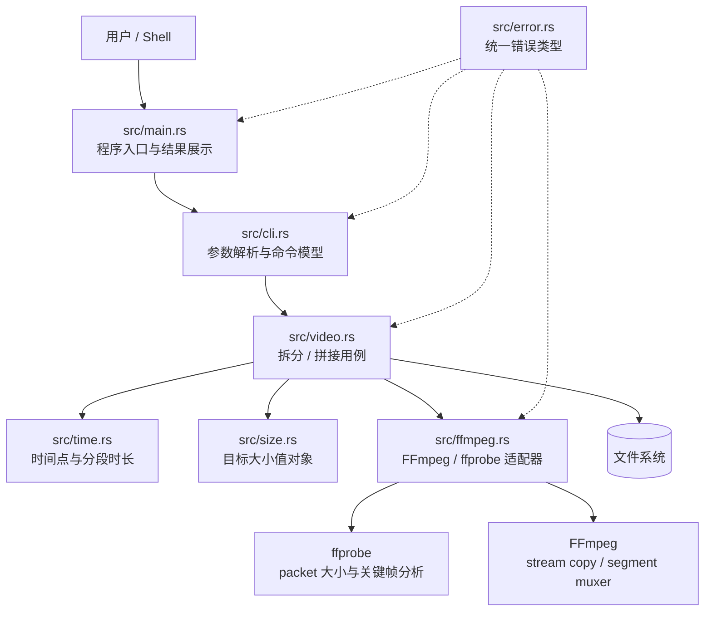
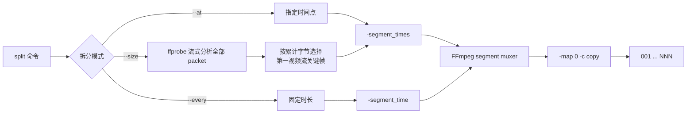

# vidsplice

`vidsplice` 是一个用 Rust 编写的视频拆分与拼接 CLI。它调用 FFmpeg，并始终使用 `-c copy` 直接复制音视频等媒体流，不进行解码和重编码，因此速度快、不会产生二次编码画质损失。

## 能力

- 按一个或多个时间点一次性拆分视频
- 按固定时长连续分段，例如每 9 分钟生成一个视频
- 按目标文件大小近似分片，例如每片约 100MB
- 按给定顺序拼接两个或更多视频
- 保留输入中的全部可映射流（`-map 0`），包括视频、音频和字幕等
- 默认拒绝覆盖已有文件，可通过 `--overwrite` 显式覆盖
- Rust 部分没有第三方 crate 依赖
- 可用环境变量指定 FFmpeg 和 ffprobe 路径

## 架构图



### 拆分数据流



按大小分片不会把所有 packet 保存在内存中：ffprobe 的输出被逐行消费，只保留第一视频流的关键帧候选，因此适合长视频。

### 拼接数据流

`vidsplice` 将所有输入规范化为绝对路径，写入一个唯一的临时 `ffconcat` 清单，然后调用 concat demuxer。无论成功还是失败，临时清单都会自动删除。

```text
输入文件列表
    ↓ 路径校验与转义
临时 ffconcat 清单
    ↓ ffmpeg -f concat -safe 0 -map 0 -c copy
输出视频
```

## 项目结构

```text
.
├── Cargo.toml          # Cargo 包和二进制配置
├── README.md           # 架构及使用文档
└── src
    ├── main.rs         # 入口、命令分发、结果输出
    ├── cli.rs          # 无第三方依赖的 CLI 参数解析
    ├── error.rs        # 应用错误类型
    ├── ffmpeg.rs       # FFmpeg 调用与 ffprobe 流式探测
    ├── size.rs         # B/KB/MB/GB/KiB/MiB/GiB 大小解析
    ├── time.rs         # 时间点及分段时长解析
    └── video.rs        # 拆分、拼接、切点计算和文件管理
```

## 环境要求

- Rust 1.85 或更新版本（使用 Rust 2024 edition）
- FFmpeg 及同套安装中的 ffprobe

macOS 使用 Homebrew 安装：

```bash
brew install ffmpeg
```

通常 `ffmpeg` 和 `ffprobe` 会同时安装。也可指定其他可执行文件：

```bash
FFMPEG_BIN=/opt/homebrew/bin/ffmpeg \
FFPROBE_BIN=/opt/homebrew/bin/ffprobe \
vidsplice split movie.mp4 --size 100MB
```

`--at` 和 `--every` 只需要 FFmpeg；`--size` 还需要 ffprobe。

## 构建与安装

```bash
cargo build --release
./target/release/vidsplice --help
```

安装到 Cargo 的二进制目录：

```bash
cargo install --path .
vidsplice --help
```

## 使用

### 按 100MB 目标大小分片

```bash
vidsplice split movie.mp4 --size 100MB
```

默认在输入视频旁创建 `movie_parts` 目录：

```text
movie_parts/movie-001.mp4
movie_parts/movie-002.mp4
movie_parts/movie-003.mp4
...
```

也可以指定输出目录和前缀：

```bash
vidsplice split movie.mp4 \
  --size 100MiB \
  --output-dir chunks \
  --prefix upload
```

支持的大小单位不区分大小写：

| 单位 | 字节数 | 示例 |
|---|---:|---|
| `B` | 1 | `500B` |
| `KB` | 1,000 | `500KB` |
| `MB` | 1,000,000 | `100MB` |
| `GB` | 1,000,000,000 | `1.5GB` |
| `KiB` | 1,024 | `500KiB` |
| `MiB` | 1,048,576 | `100MiB` |
| `GiB` | 1,073,741,824 | `1GiB` |

数值必须大于零，最多支持三位小数。用户输入的 `100mb` 等同于 `100MB`，即 100,000,000 字节。

算法会累计所有映射流的压缩 packet 大小，并在第一视频流的关键帧中选择最接近目标大小的切点。若最后剩余内容小于目标值的一半，会优先合并到前一片，避免产生很小的尾片。如果整个输入不超过目标大小，则输出一个 `-001` 文件。

> `--size` 是近似目标而非严格上限。关键帧间距、可变码率和新容器的头部/索引开销都会影响实际文件大小。如果用于有严格上限的上传接口，请设置安全余量，例如限制为 100MB 时可先尝试 `--size 90MB`，并在上传前检查生成文件。

### 每隔 9 分钟生成一个视频

```bash
vidsplice split movie.mp4 --every 9m
```

最后一段会保留剩余内容，因此可能不足 9 分钟。也可以指定输出目录和文件名前缀：

```bash
vidsplice split movie.mp4 \
  --every 9m \
  --output-dir clips \
  --prefix episode
```

`--every` 支持以下时长格式：

| 格式 | 示例 | 含义 |
|---|---|---|
| 秒 | `540s` | 540 秒 |
| 分钟 | `9m` | 9 分钟 |
| 小时 | `1h` | 1 小时 |
| 小数单位 | `1.5m` | 1 分 30 秒 |
| 时钟格式 | `00:09:00` | 9 分钟 |

### 按指定时间点拆分

```bash
vidsplice split movie.mp4 --at 00:30 --at 01:20.500
vidsplice split movie.mkv --at 30,75.5,02:10
```

时间点格式支持：

| 格式 | 示例 | 含义 |
|---|---|---|
| `SS[.mmm]` | `75.5` | 75.5 秒 |
| `MM:SS[.mmm]` | `01:15.500` | 1 分 15.5 秒 |
| `HH:MM:SS[.mmm]` | `01:02:03.250` | 1 小时 2 分 3.25 秒 |

时间点必须大于零、严格递增，毫秒部分最多三位。`--at`、`--every` 与 `--size` 必须且只能指定一种模式。

### 覆盖已有拆分文件

```bash
vidsplice split movie.mp4 --size 100MB --overwrite
vidsplice split movie.mp4 --every 9m --overwrite
vidsplice split movie.mp4 --at 30,60 --overwrite
```

固定时长和目标大小模式使用 `--overwrite` 时，会先清理输出目录中严格匹配 `<前缀>-<连续编号>.<扩展名>` 形式的已有文件；不会删除其他名称的文件。

### 拼接视频

输入顺序就是拼接顺序：

```bash
vidsplice concat joined.mp4 \
  clips/scene-001.mp4 \
  clips/scene-002.mp4 \
  clips/scene-003.mp4
```

覆盖已有输出：

```bash
vidsplice concat joined.mp4 part-1.mp4 part-2.mp4 --overwrite
```

## “无损”的准确含义与限制

本工具的无损是指**不重新编码媒体流**：FFmpeg 使用 stream copy 将压缩码流原样复制到新的容器中。因此不会产生重新编码导致的画质或音质损失。

但 stream copy 有以下固有限制：

1. **拆分边界受关键帧约束。** 输出边界只能落在已有关键帧附近，不能保证逐帧精确；按大小分片也不能在一个 GOP 中间制造切点。
2. **目标大小不是硬上限。** packet 数据大小不包含新文件全部容器开销；单个 GOP 也可能大于目标值。因此无损模式无法保证每个输出严格小于指定值。
3. **拼接输入必须兼容。** 各输入应具有相同的流数量、编码格式、分辨率、像素格式、时间基和音频参数等。最可靠的输入是由同一个源视频拆出的片段。
4. **容器必须支持对应码流。** 例如把某些 MKV 中的流直接复制到 MP4 可能失败。建议输出沿用输入容器扩展名。
5. **容器元数据可能重写。** 媒体压缩码流不重编码，但新容器的索引、时间戳或部分容器级元数据会由 FFmpeg 重新生成。

## 完整帮助

```text
vidsplice - 使用 FFmpeg 无损拆分和拼接视频

用法:
  vidsplice split <输入视频> (--at <时间点>... | --every <时长> | --size <大小>) [选项]
  vidsplice concat <输出视频> <输入视频> <输入视频>... [选项]

split 选项:
  -t, --at <时间点>       拆分点；可重复，或用逗号分隔
      --every <时长>      按固定时长分段，如 9m、540s、1h 或 00:09:00
      --size <大小>       按目标大小近似分片，如 100MB 或 100MiB
  -o, --output-dir <目录> 输出目录（默认：输入文件旁的 <文件名>_parts）
      --prefix <名称>     输出文件名前缀（默认：输入文件名）
  -y, --overwrite         覆盖已有输出
```

运行 `vidsplice --help` 可查看全部选项。
